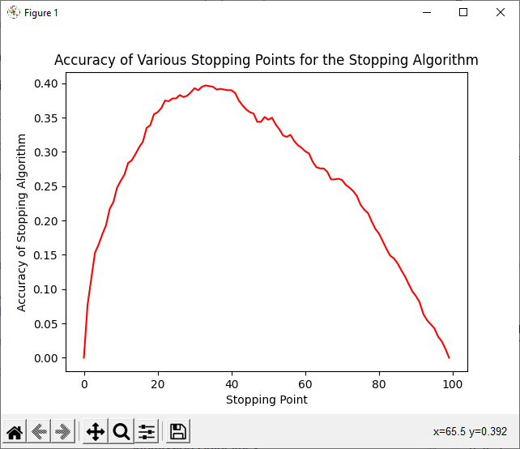
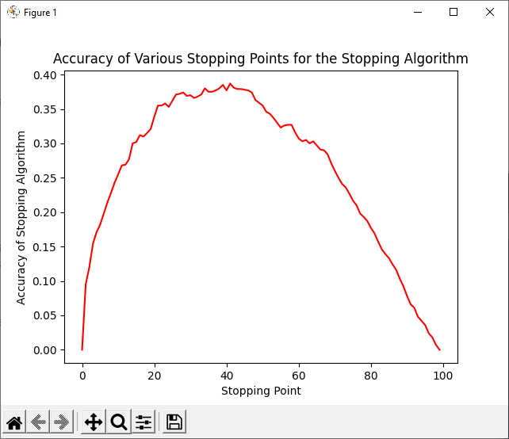
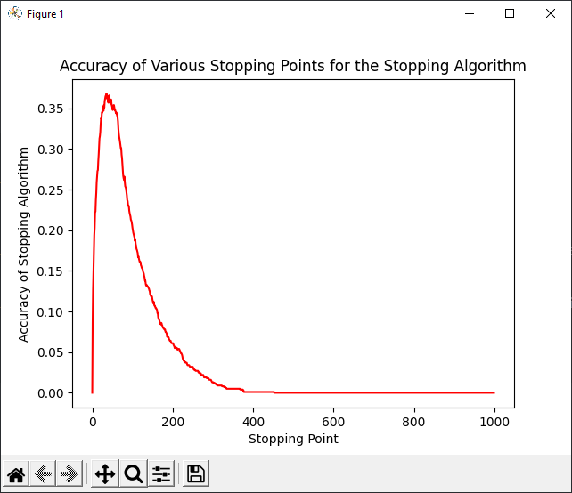
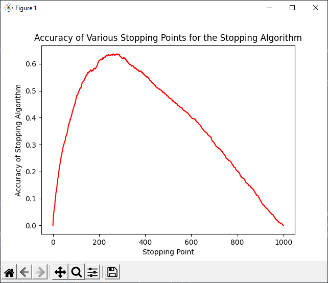
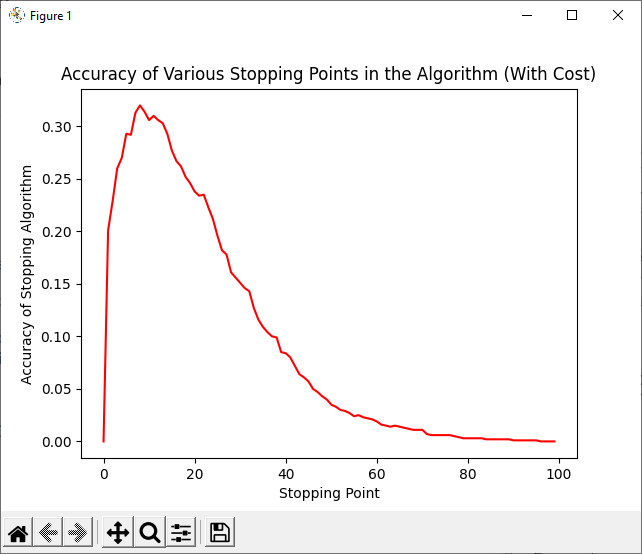
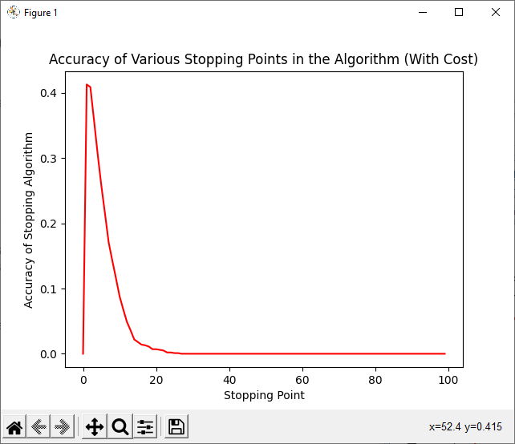

# Assignment01
## Jacob Fitzgerald (A02261889)

### Disclamer
Honesty, every time you brought up this assigment I got a slightly different impression of what you actually wanted to see. This report contains what I think you want to see, but I'm still not 100% sure. It's still not really clear to me whether you want me to provide you with the actual algorithms to find the maximum value, or just the algorithms to find the algorithms. I spent a fair amount of time on this assigment, so in all likelyhood I've already done everything you wanted, it just may not be inlucded here. 


### How to Run
The program is a (very, very) simple command line utility. When run with no arguments, it will simple run over all the test cases mentioned below, and output the results (it should be noted that for the sample csv file tests it requires the data to be located in csv files in a neighboring data directory). If it is given a path to a file, it will treat it as a csv file, and attempt to load the data it contains and run specific tests with the optimized algorithms on it, reporting the max value guessed using the algorithms, and the accuracy of the algorithms over 1000 random draws of the data set. Running it with the -help arugment prints a help message. This is not meant to be robust in the slightest, it's simply meant to give you a way to run the algorithms on tests sets, it will break if you try anything funky. 

### Part 1

#### Random Data

In order to find the optimal stopping point, we can simply run a large number of simulations on random data sets, and test which stopping point gives the best results.

Code for this can be found under the *optimalStop* method. We can run this method using the two test functions, *uniformTest* and *normalTest*.

**Results (Uniform)**
```
RUNNING UNIFORM TEST
--------------------
Finding Optimal Stopping Point for Distribution of Size 100
    Optimal Stopping Point (Human Indexed): 38
    Optimal Stopping Point as a Percentage: 0.38
    Accuracy of Optimal Stopping POint: 0.396
```

As we can see, the reported optimal stopping point is not quite what we derived in class, but it's pretty close. If we look at the graph of accuracies, it's pretty clear that our algorithm is working correctly, it's just that noise can interfere a little.

**Graph (Uniform)**



**Results (Normal)**
```
RUNNING NORMAL TEST
-------------------
Finding Optimal Stopping Point for Distribution of Size 100
    Optimal Stopping Point (Human Indexed): 33
    Optimal Stopping Point as a Percentage: 0.33
    Accuracy of Optimal Stopping POint: 0.372
```

**Graph (Normal)**


Our normal distribution yields almost identical results, except it seems to fall off a little faster. Part of this may be due to the fact that we constrained our results to be between 1 and 99 inclusive, so this may have actually led to more duplicates.

#### Test Files

Using this information to confirm what we derived in class, we can create an optimal search algorithm, which gathers data for the first 1 / e samples, and uses that to make a guess at the maximum value. This algorihtm can be found under the *optimalSearch* function.

If we run this function on our test files, using the *filesTest* test function (which expects the test files to be located in the data subdirectory), we get the follwing output.

**Results**
```
RUNNING OPTIMAL ALGORITHM ON TEST FILES
---------------------------------------
    Running Optimal Algorithm on scenario1.csv
        True Max: 99.0
        Guess: 56.0
    Running Optimal Algorithm on scenario2.csv
        True Max: 100.0
        Guess: 72.0
```

As we can see, our algorithm doesn't work for either of the test cases. That's because each test case has a high number of duplicates. Since our algorithm searches for a sample strictly greater than any seen during the data gathering phase, this means that, if a copy of the maximum value is in the first ~37% of the data, it won't be able to find any duplicates that lie outside that region. We can see that this is the case for both data sets, with scenario1 containing the maximum value, 99, at position 22, well within the gathering range. Similarly scenario2 contains the maximum value, 100, at position 6. One solution to this is to simply change the strictly greater than to a greater than or equal to in our algorithm, however, this ignores the core issue. Simply put, our algorithm isn't built for data sets like these. When calculating the optimal stopping point we assumed a ranking, that is, no duplicate values. It's still pretty terrible for our algorithm to essentially always pick the last option in the list for these cases, so we can make some changes to it.

Using a similar (but far less exhaustive) philosophy to that of the book, we can implement a "failsafe" that allows us to get an okay value in cases like these. If we consider working backwards, when we're on the second to last position, we only want to accept that position if it's better than average. That's because the expected value of the final position, a complete unkown, is by definition average. If we assume (which we really can't) that our data is somewhat uniformly distributed, we can assume the average is probably around half the max of the value found in the data gathering phase. We can extrapolate this threshold throughout the dataset, allowing for much less variation over all, using a linerally increasing threshold, which, while not backed by mathematical principles, is easy to implement.

This updated search algorithm can be found under the *comprimisingSearch* function. We can run it on our test data using the test function *filesTest2*.

**Result**
```
RUNNING COMPROMISING ALGORITHM ON TEST FILES
---------------------------------------
    Running Compromising Algorithm on scenario1.csv
        True Max: 99.0
        Guess: 97.0
    Running Compromising Algorithm on scenario2.csv
        True Max: 100.0
        Guess: 94.0
```

In this case, our algorithm didn't return the absolute maximum, but it got us something pretty close, which I'd say is a success.

#### Test Files (Cont.)

So originally I wrote the code to analyze the optimal stopping point for the test files, and then converted it to using random distributions after you elaborated on the assignment in class. Apparently my original intention was right though? I'm still not sure, so I'll add a few quick modifications to the code.

I'll throw in a optimalFileTest1() and optimalFileTest2() functions, which will run our optimal stopping point algorithm on test files one and two respecitivley. I don't have a lot of time to make these changes, so just know that they're hardcoded with the specific file paths.

**Results**
```
RUNNING OPTIMAL FILE TEST 1
---------------------------
Finding Optimal Stopping Point for Distribution of Size 1000
    Optimal Stopping Point (Human Indexed): 44
    Optimal Stopping Point as a Percentage: 0.044
    Accuracy of Optimal Stopping POint: 0.347


RUNNING OPTIMAL FILE TEST 2
---------------------------
Finding Optimal Stopping Point for Distribution of Size 1000
    Optimal Stopping Point (Human Indexed): 317
    Optimal Stopping Point as a Percentage: 0.317
    Accuracy of Optimal Stopping POint: 0.635
```

**Graph (File 1)**


**Graph (File 2)**


Here we get a bit of an interesting result. The optimal stopping point is much earlier than expected. This can be explained very simply. Since our algorithm looks for a value excceding the one found during exploration phase, in a dataset with many duplicates, it can be disadvantageous to explore too much, as you may find the maximum value during exploration. This means the algorithm won't consider any duplicate maximums, and will instead return the last value. Since our values range from 1 to 100, in a uniform distribution, you'll get much, much more data. Looking at the graphs, you can see that you only need about 3-4% of the data for test data set one. For data set 2, it's closer to 30%, so not nearly as early. I'm guessing it's due to a different distribution, where higher values are more rare. Either way, the high quanitty of duplicate data makes it a little easier. 

When it comes to coding specific search algorithms customized to each data set, we can instead just create a generic search function that accepts a stopping percentage. This can be found under the optimalSearchGeneric function. If you want to see it run on arbitrary data sets with the stopping points discovered above, I've added it to the command line testing options. The result of running it on the test files is as follows.

**Results**
```
$python HW1_Fitzgerald_Jacob.py data/scenario1.csv
TESTING ALGORITHMS ON STATIC DATA SETS
    Running Optimal Algorithm on scenario1.csv
        True Max: 99.0
        Guess: 56.0
        Accuracy Over 1000 Random Draws: 0.01
    Running Compromising Algorithm on scenario1.csv
        True Max: 99.0
        Guess: 97.0
        Accuracy Over 1000 Random Draws: 0.463
    Running Data Set 1 Algorithm (3.7% Stop Point) on scenario1.csv
        True Max: 99.0
        Guess: 56.0
        Accuracy Over 1000 Random Draws: 0.352
    Running Data Set 2 Algorithm (30% Stop Point) on scenario1.csv
        True Max: 99.0
        Guess: 56.0
        Accuracy Over 1000 Random Draws: 0.029

$python HW1_Fitzgerald_Jacob.py data/scenario2.csv
TESTING ALGORITHMS ON STATIC DATA SETS
    Running Optimal Algorithm on scenario2.csv
        True Max: 100.0
        Guess: 72.0
        Accuracy Over 1000 Random Draws: 0.587
    Running Compromising Algorithm on scenario2.csv
        True Max: 100.0
        Guess: 94.0
        Accuracy Over 1000 Random Draws: 0.004
    Running Data Set 1 Algorithm (3.7% Stop Point) on scenario2.csv
        True Max: 100.0
        Guess: 72.0
        Accuracy Over 1000 Random Draws: 0.262
    Running Data Set 2 Algorithm (30% Stop Point) on scenario2.csv
        True Max: 100.0
        Guess: 72.0
        Accuracy Over 1000 Random Draws: 0.601
```
### Part 2

#### Randomized Data

For this part, we have to consider a cost for exploring. Basically, if each sample represents a realizable gain, and if getting sample data incures a standardized loss, our decision making process changes. In this case, we're assuming a "cost" of 1 for each data sample, and a "reward" of x for choosing a sample n, where x is the numerical value of data sample n. You'd think we'd need to rewrite our algorithm for finding the optimal stopping point, but it actually remains pretty much the same. All we really need to do is change the data itself, not the algorithm. Instead of reflecting the "value" of each sample, we can change our lists to reflect the expected "profit" of each sample. This is as simple as iterating through the list and subtracting the list index times the cost from the sample. Basically, we're saying that if the maximum gain (say 100) sits all the way at the end of our list (say position 50) it only has a "real" value of 50, and is therefore less than a sample with 60 gain sitting at position 3. In this case, our algorithm will not return the true maximum, but rather the maximum possible benifit.

Code for finding this stopping point can be found under the *optimalStopWithCost* function.

We can run it using the *uniformCostTest* and *normalCostTest* test functions to see how it performs on both uniform and normal data.

**Results (Uniform)**
```
RUNNING UNIFORM TEST WITH COST
------------------------------
Finding Optimal Stopping Point for Distribution of Size 100 and Exploration Cost of 1
    Optimal Stopping Point (Human Indexed): 11
    Optimal Stopping Point as a Percentage: 0.11
    Accuracy of Optimal Stopping POint: 0.323
```

**Graph (Uniform)**


As we can see, the accuracy of this method drops off a cliff after a few samples. That's because, with a uniform data set, high and low values are equally likely to occur at any position. However, with the cost increasing with the number of samples, an early high value will vastly outweigh a later high value.

**Results (Normal)**
```
RUNNING NORMAL TEST WITH COST
Finding Optimal Stopping Point for Distribution of Size 100 and Exploration Cost of 1
    Optimal Stopping Point (Human Indexed): 2
    Optimal Stopping Point as a Percentage: 0.02
    Accuracy of Optimal Stopping POint: 0.387
```

**Graph (Normal)**


Similar results to above, but with an even faster decline. This makes sense because, with a normal data set, everything should cluster much closer to the mean. This means that later values in the data set will have a much lower chance to be of high enough value to offset the vastly increased cost. 

### Answers

1. For a uniform or normal data set, the optimal stopping point is around 37%, give or take.
2. For a uniform data set with exploration cost of 1, the optimal stopping point is around 10%, give or take.
3. For a normal data set with exploration cost of 1, the optimal stopping point is around 2%, give or take. Basically, you only need one or two samples. 


### Testing Example

This is an example of the data set testing feature of the program done using one of the example data sets.

**Command**
```
python HW1_Fitzgerald_Jacob.py "./data/scenario1.csv"
```

**Result**
```
TESTING ALGORITHMS ON STATIC DATA SETS
    Running Optimal Algorithm on scenario1.csv
        True Max: 99.0
        Guess: 56.0
        Accuracy Over 1000 Random Draws: 0.014
    Running Compromising Algorithm on scenario1.csv
        True Max: 99.0
        Guess: 97.0
        Accuracy Over 1000 Random Draws: 0.503
```

In this case, we can see that our accuracies are all over the place. That's because these data sets don't even come close to following the assumptions used to cacluate the optimal stopping point. The presence of duplicates means that it's very likely that our strictly greater than method of comparison in our algorithm will result in no answer.

Our compromising algorithm appears to be very effective, likely for the same reason, because it allows equal or near equal values, which the duplicates would greatly aid.

Either way, you can't really expect the accuracies to equal the answer values unless appropriate data is used.

